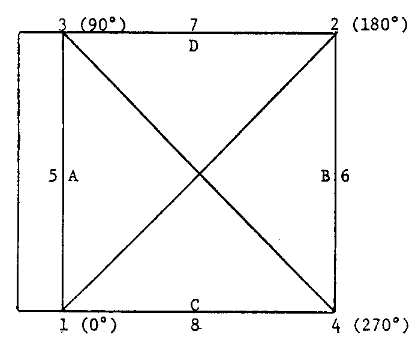

# historic aerial photo calibration reports

## dataset

This repository contains information manually extracted from calibration reports provided by the 
[USGS Camera Calibration Reports](https://calval.cr.usgs.gov/cameracal/reports.html) database. 

Additionally, calculates summary information for different aerial camera fiducial marker patterns, based on browse 
images and calibration reports downloaded from [USGS EarthExplorer](https://earthexplorer.usgs.gov). 

### combined_reports.csv

This file contains the following fields:

- `cal_file` - the filename of the calibration report. Note that in the filenames, spaces have been replaced by an
  underscore (`_`).
- `date` - the date of the calibration report
- `camera_make` - the manufacturer of the camera
- `camera_model` - the model of the camera
- `camera_serial` - the serial number of the camera
- `lens_make` - the manufacturer of the lens
- `lens_model` - the model of the lens
- `lens_serial` - the serial number of the lens
- `focal` - the calibrated focal length (in mm) of the lens 

Some (but not all) of the calibration reports also contain information about either the separation distance between
fiducial markers, or the position of the fiducial markers relative to the principal point.

These measurements are typically reported with the data strip along the left-hand side of the image, so that is the
convention that I have used here. Some earlier calibration reports are given with the data strip along the top of the
image; to keep consistency with later reports, I have rotated the measurement frame so that the data strip is along
the left side of the image frame.

An example of the expected layout of the camera, taken from one of the calibration reports, is shown here:

- `*_dist` - the distance (in mm) between the two fiducial markers in the line of flight (`lr` for "left-right", `5-6`
  or `A-B` in the above diagram), perpendicular to the line of flight (`tb` for "top-bottom", `7-8` or `C-D` in the
  above diagram), or between the corners (`llur` and `ullr` for "lower left to upper right" (`1-2`) and 
  "upper left to lower right" (3-4), respectively).
- `*x` and `*y` - the reported location (in mm) for the individual fiducial markers. `ml` indicates the mid-side left
  fiducial markers (`5` or `A`), `mr` the mid-side right (`6` or `B`, `mt` the mid-side top (`7` or `D`), and `mb` 
  the mid-side bottom markers (`8` or `C`), respectively. `ll` (`1`), `ur` (`2`), `ul` (`3`), and `lr` (`4`) are the
  lower left, upper right, upper left, and lower right markers, respectively.

### calibration_information_cleaned.csv

In addition to the information contained in `combined_reports.csv`, this file contains the following fields:

- `ID` - the [EarthExplorer](https://earthexplorer.usgs.gov) Entity ID for an example image with the given fiducial
  marker pattern.
- `marker_style` - the type of fiducial marker used in the camera. For examples of the different types of markers,
  see https://spymicmac.readthedocs.io/en/latest/cameras.html.

## notebooks

### pattern_summary.ipynb

For each type of fiducial marker pattern, the notebook `pattern_summary.ipynb` will display the following information: 

- fiducial marker separation distance (mean ± standard deviation, median)
- where available, fiducial marker location: x, y position (mean ± standard deviation) and angle with respect 
  to the principal point coordinate system (in degrees)
- number of reports, summarized by camera names

For examples of what each pattern looks like, see https://spymicmac.readthedocs.io/en/cameras.html.

### report_summary.ipynb

This notebook calculates summary information for `data/combined_reports.csv`, including the total number of (unique)
reports, and the number of reports for each camera make/model.

## summary information

As of the latest update `data/combined_reports.csv` has information from 1392 reports, summarized by 
camera make/model:

+----------------------------+---------+
| camera_name                |   count |
+============================+=========+
| Wild Heerbrugg RC8         |     399 |
+----------------------------+---------+
| Park                       |     172 |
+----------------------------+---------+
| Fairchild K-17 (modified)  |     142 |
+----------------------------+---------+
| Zeiss RMK A 15/23          |      93 |
+----------------------------+---------+
| Fairchild T-12             |      84 |
+----------------------------+---------+
| Fairchild K-3B (modified)  |      78 |
+----------------------------+---------+
| Fairchild T-11             |      40 |
+----------------------------+---------+
| Fairchild K-17B (modified) |      32 |
+----------------------------+---------+
| Zeiss RMK 15/23            |      25 |
+----------------------------+---------+
| Wild Heerbrugg RC10        |      25 |
+----------------------------+---------+
| Fairchild T-5              |      22 |
+----------------------------+---------+
| Fairchild KC-1             |      22 |
+----------------------------+---------+
| K-24                       |      22 |
+----------------------------+---------+
| Aero/View Type 800         |      19 |
+----------------------------+---------+
| Park Twinplex              |      19 |
+----------------------------+---------+
| Wild Heerbrugg RC5         |      16 |
+----------------------------+---------+
| Fairchild K-17             |      15 |
+----------------------------+---------+
| Wild Heerbrugg RC9         |      14 |
+----------------------------+---------+
| Fairchild KC-1B            |      14 |
+----------------------------+---------+
| Smith                      |      13 |
+----------------------------+---------+
| Zeiss RMK A 21/23          |      12 |
+----------------------------+---------+
| Airagon                    |       9 |
+----------------------------+---------+
| Aero/View                  |       9 |
+----------------------------+---------+
| Aero                       |       9 |
+----------------------------+---------+
| Wild Heerbrugg RC5A        |       9 |
+----------------------------+---------+
| Fairchild F-225            |       6 |
+----------------------------+---------+
| Fairchild KC-1A            |       6 |
+----------------------------+---------+
| Fairchild F-224            |       5 |
+----------------------------+---------+
| Zeiss RMK A 8.5/23         |       5 |
+----------------------------+---------+
| Wild Heerbrugg RC5/8       |       5 |
+----------------------------+---------+
| Aero/View Type 600         |       5 |
+----------------------------+---------+
| Hurd                       |       5 |
+----------------------------+---------+
| WAC                        |       4 |
+----------------------------+---------+
| Fairchild KC-4B            |       4 |
+----------------------------+---------+
|                            |       3 |
+----------------------------+---------+
| Zeiss Jena MRB 15/2323     |       3 |
+----------------------------+---------+
| Fairchild KC-8             |       3 |
+----------------------------+---------+
| Fairchild KC-4             |       3 |
+----------------------------+---------+
| Fairchild K-17B            |       2 |
+----------------------------+---------+
| Fairchild K-17C (modified) |       2 |
+----------------------------+---------+
| Fairchild T-12A            |       2 |
+----------------------------+---------+
| Fairchild KC-4A            |       1 |
+----------------------------+---------+
| Aero/View Type 1200        |       1 |
+----------------------------+---------+
| Fairchild                  |       1 |
+----------------------------+---------+
| Fairchild KC-6A            |       1 |
+----------------------------+---------+
| Kargl                      |       1 |
+----------------------------+---------+
| Kargl K1C8                 |       1 |
+----------------------------+---------+
| Kargl K-17                 |       1 |
+----------------------------+---------+
| Wild Heerbrugg             |       1 |
+----------------------------+---------+
| Kargl K1C-8G-9             |       1 |
+----------------------------+---------+
| Zeiss Jena LMK 2000        |       1 |
+----------------------------+---------+
| Zeiss RMK 30/23            |       1 |
+----------------------------+---------+
| Zeiss RMK A 30/23          |       1 |
+----------------------------+---------+
| Zeiss RMK AR 15/23         |       1 |
+----------------------------+---------+
| Zeiss RMK AR 30/23         |       1 |
+----------------------------+---------+
| Zeiss RMK TOP 30           |       1 |
+----------------------------+---------+

## contributing

Contributions (including corrections) to this dataset are very welcome. If you would like to contribute, please
fork this repository and submit a Pull Request (https://github.com/iamdonovan/fiducial_markers/pulls).

Alternatively, you are welcome to open an issue for further discussion (https://github.com/iamdonovan/fiducial_markers/issues).
